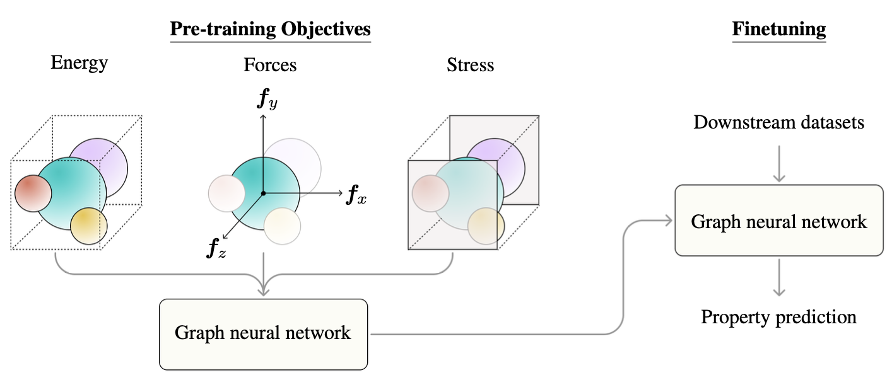

## Derivative-based Pre-training of Graph Neural Networks for Materials Property Predictions


## Installation

1. Pre-install step:
   ```
   pip install conda-merge
   ```
2. Create conda environment:
   1. GPU machines:
      ```
      conda-merge env.common.yaml env.gpu.yaml > env.yaml
      conda env create -f env.yaml
      conda activate matdeeplearn
      ```

   2. CPU-only machines:

      1. M1 Macs (see https://github.com/pyg-team/pytorch_geometric/issues/4549):
         ```
         conda env create -f env.common.yaml
         conda activate matdeeplearn
         MACOSX_DEPLOYMENT_TARGET=10.9 CC=clang CXX=clang++ pip install torch-scatter torch-sparse torch-geometric -f https://data.pyg.org/whl/torch-1.12.0+cpu.html
         ```
         Note: if pip is using cached wheels and the build is failing, add `--no-cache-dir` flag.

      2. Everyone else:
         ```
         conda-merge env.common.yaml env.cpu.yaml > env.yaml
         conda env create -f env.yaml
         conda activate matdeeplearn
         ```

3. Install package:
   ```
   pip install -e .
   ```

4. Checkout current branch:
   ```
   git checkout pretraining_with_forces
   ```

## Data
### Pre-training Datasets
#### MP Data Forces & MP Data Forces Relaxed
This is a dataset for Materials Project containing forces intended for training machine learning potentials. Total energies for the entire system and forces per atom are provided. [[Paper]](https://arxiv.org/abs/2202.02450) [[Download]](https://figshare.com/articles/dataset/MPF_2021_2_8/19470599)

#### Finetuning Datasets
1. MatBench Suite [[Paper]](https://www.nature.com/articles/s41524-020-00406-3)[[Website]](https://matbench.materialsproject.org/)
2. 2D Materials Dataset [[Paper]](https://iopscience.iop.org/article/10.1088/2053-1583/aacfc1/meta)[[Website]](https://cmr.fysik.dtu.dk/c2db/c2db.html)
3. Metal-organic Frameworks (MOF) Dataset [[Paper]](https://www.sciencedirect.com/science/article/pii/S2590238521000709)[[Website]](https://github.com/Andrew-S-Rosen/QMOF)
4. Metal Alloy Surfaces (Surface) Dataset [[Paper]](https://www.nature.com/articles/s41597-019-0080-z)[[Website]](https://www.catalysis-hub.org/)

## Usage
### Pre-training
#### Derivative-based Pre-training with Forces, Energies and Stress
```
python scripts/main.py --run_mode=train --config_path=configs/pretraining/forces.yml
```
- The ratio `energy:forces:stress` can be configured at Line 54 of the yaml file.
- Path to the pre-training dataset needs to be specified at Line 75.

#### Derivative-based Pre-training via Denoising
```
python scripts/main.py --run_mode=train --config_path=configs/pretraining/derivative_denoising.yml
```

#### Prediction Head Pre-training via Denoising
```
python scripts/main.py --run_mode=train --config_path=configs/pretraining/prediction_denoising.yml
```

### Finetuning
```
python scripts/main.py --run_mode=finetune --config_path=configs/finetune.yml
```
- Path to the pre-trained model needs to be specified at Line 16.
- Path to the finetuning dataset needs to be specified at Line 75. 